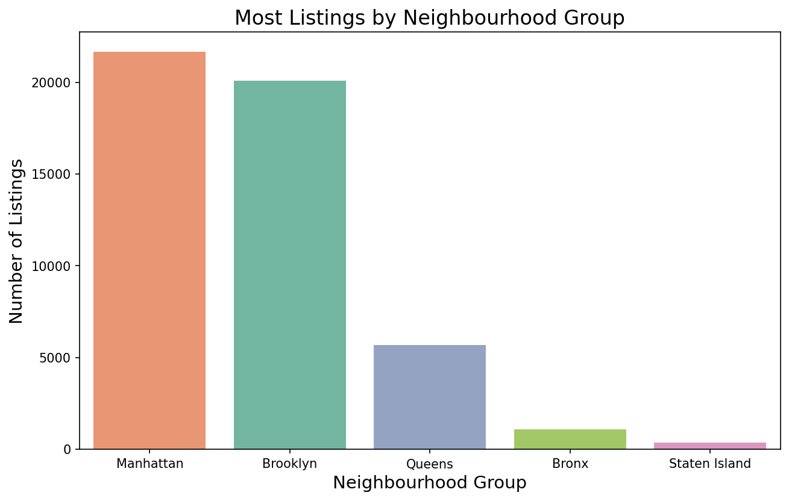
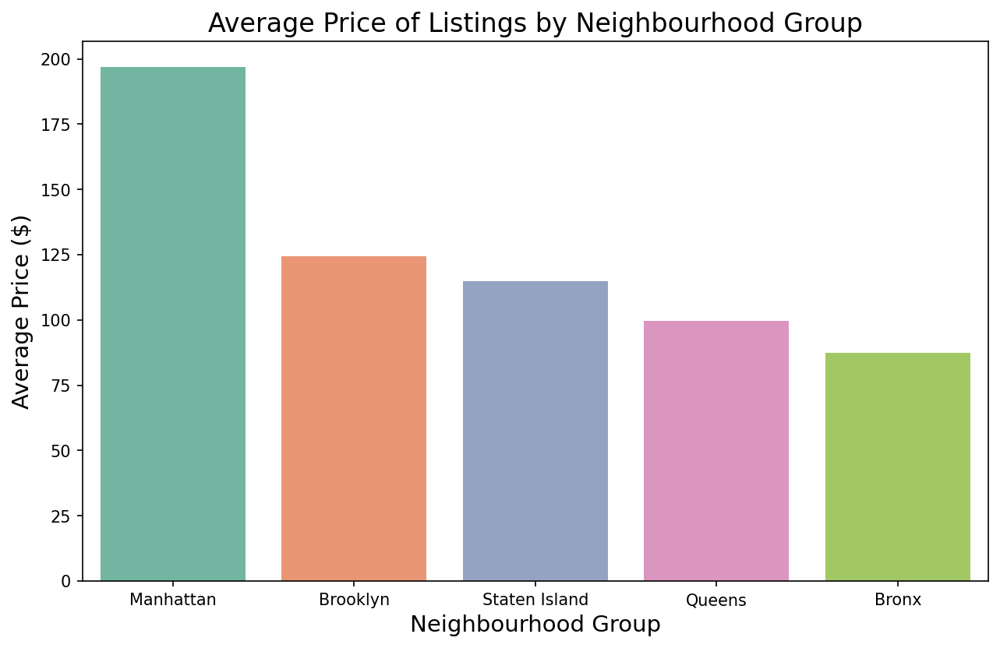
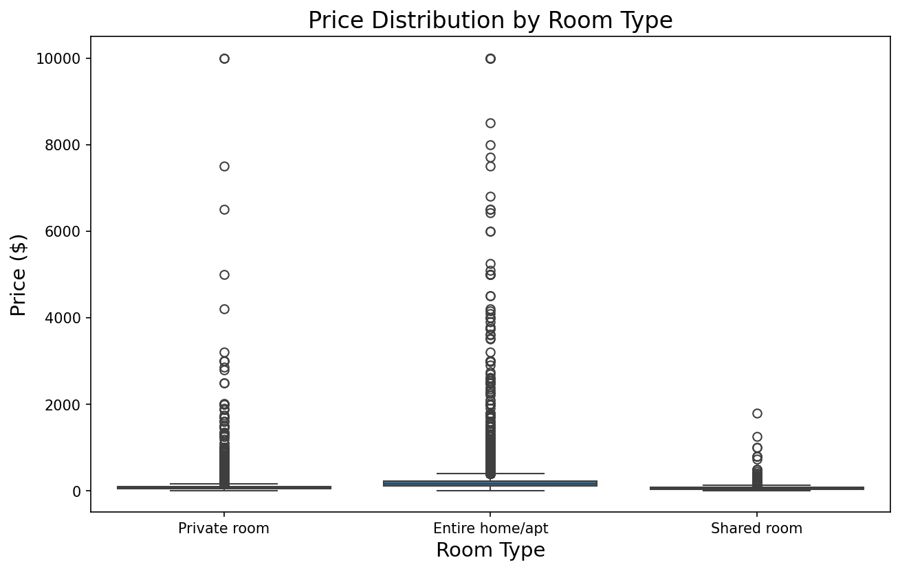
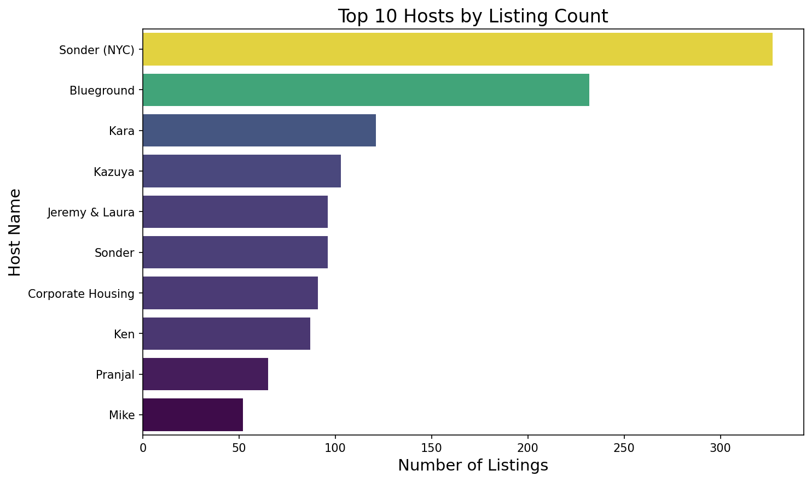
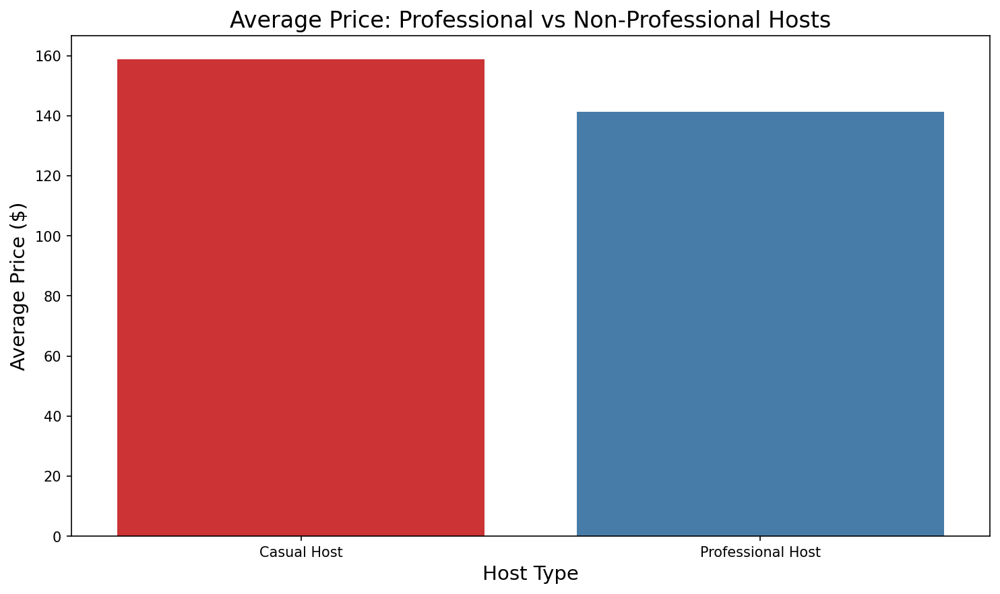
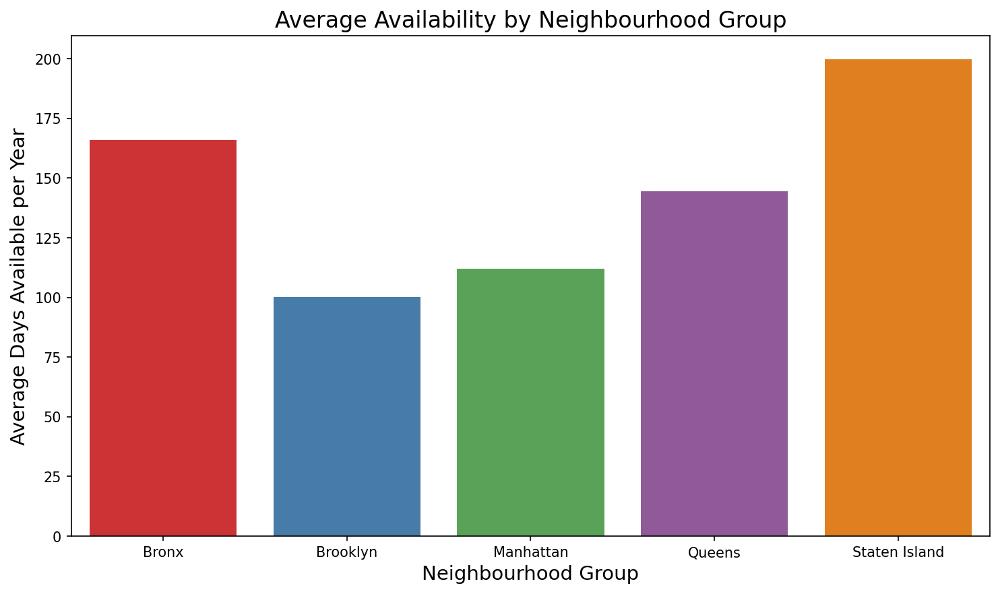
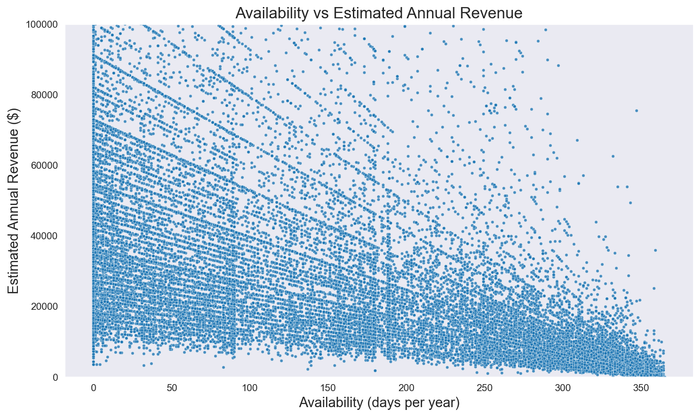
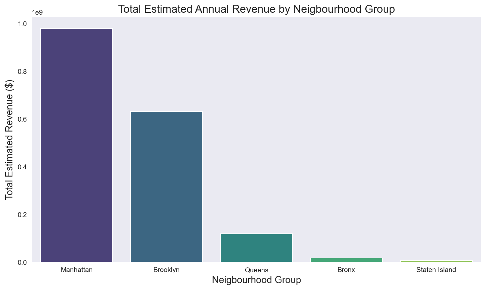
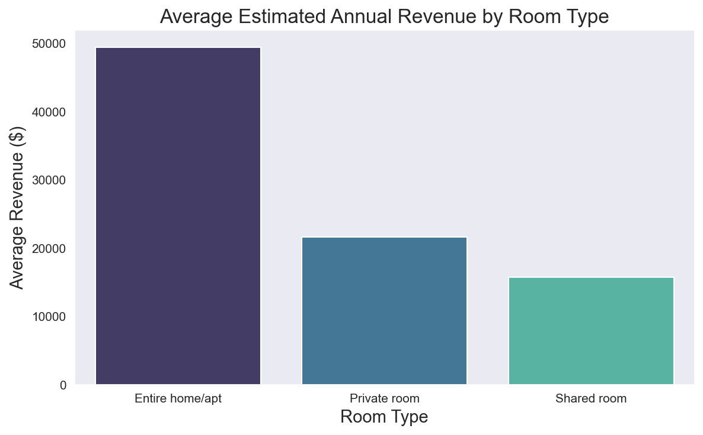
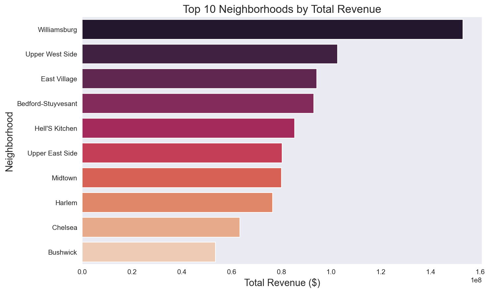

# NYC Airbnb Market Analysis Report

## Executive Summary

This analysis examines 48,884 Airbnb listings across New York City to uncover pricing patterns, market distribution, and revenue opportunities. Key findings reveal that Manhattan dominates both in listing count and revenue generation, while professional hosts (2+ properties) charge 11% less than casual hosts. The analysis provides actionable insights for investors, hosts, and platform optimization.

---

## 1. Introduction

### 1.1 Business Problem

Understanding the NYC Airbnb market dynamics to identify:

- Which boroughs offer the best investment opportunities
- Pricing strategies that maximize revenue
- Host behavior patterns and their impact on earnings

### 1.2 Objectives

- Analyze geographic distribution of listings
- Identify pricing factors and patterns
- Estimate revenue potential by location and host type
- Provide data-driven recommendations

### 1.3 Dataset Overview

- **Total Listings**: 48,884
- **Total Hosts**: 37,455
- **Boroughs Covered**: 5 (Manhattan, Brooklyn, Queens, Bronx, Staten Island)
- **Time Period**: Current snapshot of active listings

---

## 2. Data Cleaning & Preparation

### 2.1 Data Quality Issues Addressed

- **Missing Values**: Filled missing host names with "Unknown"
- **Date Formatting**: Converted date columns to datetime format
- **Duplicates**: Removed duplicate records
- **Outliers**: Identified and handled price outliers
- **Review Metrics**: Handled missing review data

### 2.2 Feature Engineering

- Created `professional_host` flag (hosts with 2+ listings)
- Calculated `estimated_annual_revenue` = price × (365 - availability_365)
- Derived booking frequency from availability data

---

## 3. Key Findings

### 3.1 Geographic Distribution

**Manhattan leads the market:**

- 21,660 listings (44.3% of total)
- Highest average price: $196/night
- Generates $980M in estimated annual revenue

**Brooklyn follows closely:**

- 20,095 listings (41.1% of total)
- Average price: $124/night
- More affordable alternative with high density

**Key Insight**: Manhattan and Brooklyn account for 85% of all NYC Airbnb listings.

### 3.2 Pricing Analysis

**Price Distribution by Borough:**

- Manhattan: $196/night (highest)
- Brooklyn: $124/night
- Queens: $100/night
- Bronx: $87/night
- Staten Island: $114/night

**Room Type Impact:**

- Entire homes: $211/night average
- Private rooms: $89/night average
- Shared rooms: $70/night average

**Key Insight**: Entire homes command 2.4x premium over private rooms.

### 3.3 Host Behavior Patterns

**Professional vs Casual Hosts:**

- 66% of listings belong to casual hosts (1 property)
- 34% belong to professional hosts (2+ properties)
- Casual hosts charge $159/night vs $141/night for professionals

**Top Host Concentration:**

- Top host manages 327 listings (Sonder NYC)
- Top 10 hosts control 1,270 listings combined
- Professional hosts dominate Manhattan and Brooklyn

**Key Insight**: Casual hosts charge premium prices, likely due to unique properties or personal touch.

### 3.4 Availability & Booking Patterns

**Availability by Borough:**

- Staten Island: 200 days/year (highest availability = lowest demand)
- Bronx: 166 days/year
- Queens: 144 days/year
- Manhattan: 112 days/year (lowest availability = highest demand)
- Brooklyn: 100 days/year

**Room Type Availability:**

- Shared rooms: 162 days/year (weak demand)
- Entire homes: 112 days/year
- Private rooms: 111 days/year

**Key Insight**: Negative correlation (-0.28) between availability and revenue confirms that successful listings are frequently booked.

### 3.5 Revenue Analysis

**Total Revenue by Borough:**

1. Manhattan: $980M (55.6%)
2. Brooklyn: $633M (35.9%)
3. Queens: $119M (6.8%)
4. Bronx: $18M (1.0%)
5. Staten Island: $7M (0.4%)

**Average Revenue per Listing:**

- Entire homes: Highest earners
- Professional hosts: Don't necessarily earn more per listing
- Location matters more than host type

**Top Revenue Neighborhoods:**

- Concentrated in Manhattan (Midtown, Financial District)
- Williamsburg and Bedford-Stuyvesant in Brooklyn

**Key Insight**: Manhattan generates 55% of total platform revenue despite having only 44% of listings.

---

## 4. Business Recommendations

### 4.1 For Investors

1. **Focus on Manhattan** for premium returns and consistent bookings
2. **Consider Brooklyn** for volume-based strategy with lower entry costs
3. **Target entire home properties** - they generate 2x revenue of private rooms
4. **Avoid Staten Island and Bronx** - low demand and revenue potential

### 4.2 For Hosts

1. **Price competitively**: Professional hosts succeed with volume, not premium pricing
2. **Maintain high availability**: Low availability correlates with high revenue (frequent bookings)
3. **Location is key**: Manhattan and Brooklyn neighborhoods outperform others
4. **Room type matters**: Entire homes justify higher investment

### 4.3 For Platform (Airbnb)

1. **Support mid-range listings**: They balance demand and pricing effectively
2. **Incentivize Brooklyn hosts**: High density market with growth potential
3. **Address shared room demand**: Weakest segment needs repositioning
4. **Monitor professional hosts**: Ensure quality doesn't suffer with scale

---

## 5. Conclusion

The NYC Airbnb market is dominated by Manhattan and Brooklyn, with clear opportunities for both investors and hosts. Success factors include:

- **Location**: Manhattan for premium, Brooklyn for volume
- **Property type**: Entire homes generate highest revenue
- **Pricing strategy**: Competitive pricing with high booking frequency
- **Host type**: Both casual and professional hosts can succeed with different strategies

The analysis reveals a mature market with clear winners (Manhattan entire homes) and opportunities (Brooklyn mid-range properties). Data-driven decision making is essential for success in this competitive landscape.

---

## Appendix

### A. Tools & Technologies

- **Python 3.13**: Data analysis
- **Pandas**: Data manipulation
- **Seaborn/Matplotlib**: Visualizations
- **Jupyter Notebooks**: Interactive analysis

### B. Data Source

NYC Airbnb Open Data (Kaggle/Inside Airbnb)
